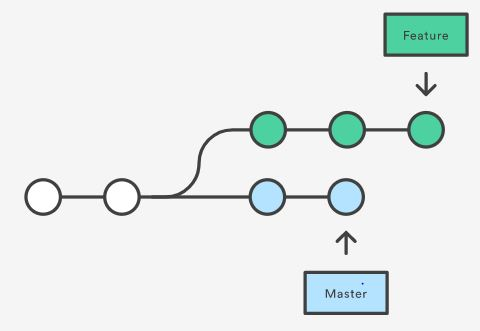
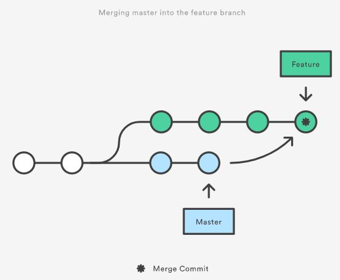
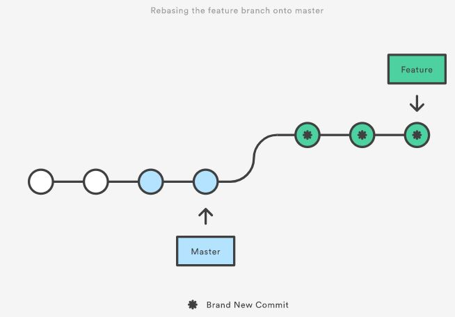
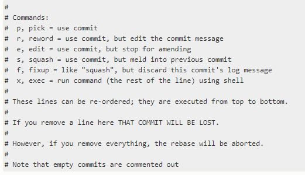
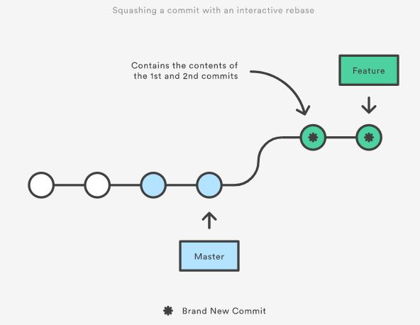
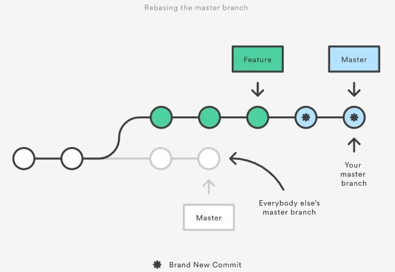
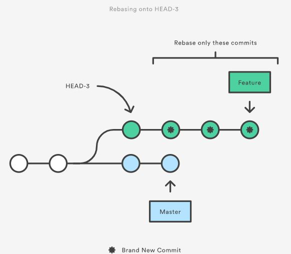
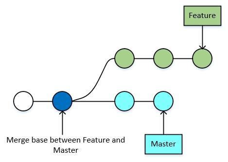

# Merge vs Rebase

## Overview
**Tình huống đặt ra**: Bạn đang làm việc trên branch `feature`, và có new commits trên branch `master`, vậy sẽ có 2 cách để bạn update new commits này từ `master` vào `feature` branch: **merge** và **rebase**



### Merge
*Chức năng*:
 > Merge takes a set of changes from the source branch and moves them into your current branch as a special commit.

Merge là lệnh **non-destructive**, tức là sau khi merge thì branch `master` sẽ k thay đổi. (*lưu ý*: Điều này sẽ khác khi thao tác rebase). Để thực hiện merge `master` &rightarrow; `feature` (`master` sẽ là source branch và `feature` là your current branch), sử dụng:
```
git checkout feature
git merge master
```
Sau khi thực hiện merge thì sẽ có một new **merge commit** tại branch `feature`.




### Rebase
*Chức năng*:
> A rebase takes your current branch and rebuilds it on top of the source branch, effectively rewriting the history.

Để thực hiện rebase `feature` &rightarrow; `master`, sử dụng:
```
git checkout feature
git rebase master
```
Câu lệnh sẽ thực hiện **move** cả `feature` branch đến `master` branch. Nếu `feature` branch có **n** commits thì sau khi rebase, `master` branch cũng sẽ được thêm **n** new commits.



Rebase cho phép lựa chọn commits sẽ được thêm mới vào destination branch  là `master`, sử dụng **rebase interactive mode**: `git rebase -i master`.

Một số options người dùng có thể chỉnh sửa để phù hợp với actions mong muốn:


Ví dụ:
* Nếu người dùng giữ nguyên interactive rebasing session như dưới đây thì 3 new commits sẽ được rebase.
    ```
    pick 123456a Message for commit #1
    pick 123456b Message for commit #2
    pick 123456c Message for commit #3
    ```
* Ngưới dùng có thể gộp các commit lại thành một commit mới, sử dụng options **squash** hoặc **fixup**.
    * **squash** cho phép người dùng merge commit hiện tại với commit above it, và cho phép thay đổi commit message.
    * **fixup** cũng có chức năng tương tự **squash** tuy nhiên commit sẽ sử dụng commit message của commit above it.
    ```
    pick 123456a Message for commit #1
    fixup 123456b Message for commit #2
    pick 123456c Message for commit #3
    ```

    


## The Golden Rule of Rebasing

Tình huống dưới đây xảy ra khi bạn thực hiện **rebase** branch `master` &rightarrow; *your* `feature` branch. Lúc này Git sẽ cho rằng `master` branch history của bạn sẽ khác so với branch `master` của mọi người, gây ra sự bất đồng bộ cho branch `master`.



Giải pháp để đồng bộ your `master` branch và everyone's `master` branch là **merge** hai branch này với nhau, tuy nhiên sẽ sinh ra extra merge commits.

## Helpful tips

### Using **rebase** for local cleanup
Chúng ta có thể sử dụng **rebase interactive mode** để gộp nhiều commits hay sắp xếp lại thứ tự commits tại branch `feature` đang phát triển, giúp cho branch history của chúng ta **cleaner** hơn trước khi thực hiện **pull request**. Một branch sẽ là unclean sẽ bao gồm nhiều commits kiểu như là "Sửa lỗi lần 1", "Sửa lỗi lần 2", ...

Ví dụ command dưới đây sẽ thực hiện một interactive rebase session thực hiện rewrite 3 last commits:
```
git checkout feature
git rebase -i HEAD~3
```



Nếu người dùng muốn rewrite toàn bộ, trước hết hãy sử dụng `git merge-base feature master`. Câu lệnh này trả về giá trị **commit ID** của commit nơi `feature` branch được rẽ nhánh. Sau đó sử dụng commit ID này cho câu lệnh `git rebase -i <commit-id>`


